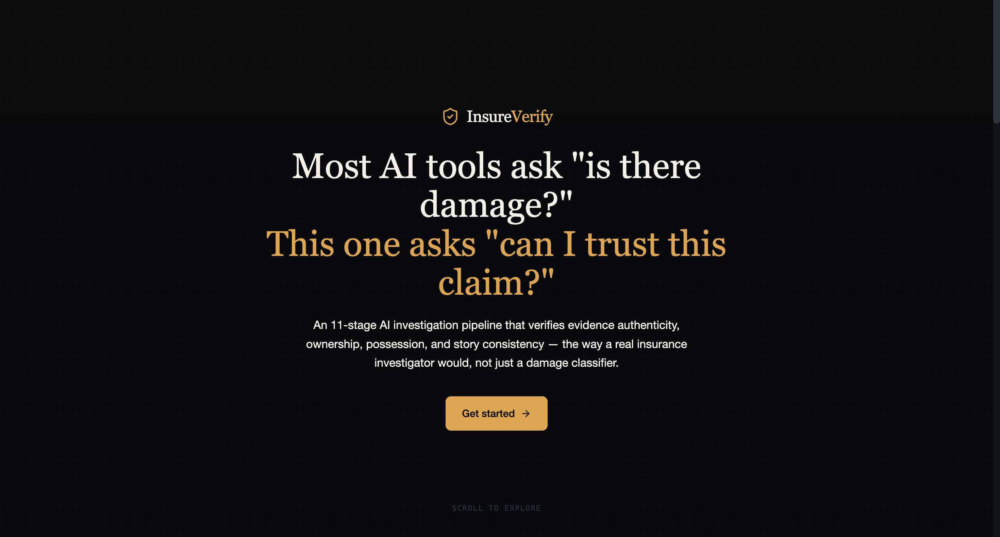
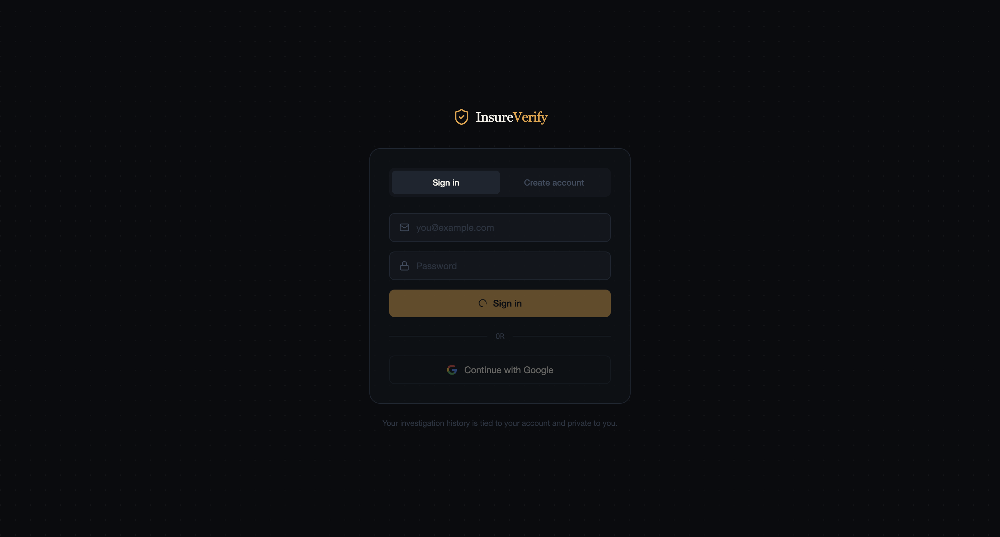
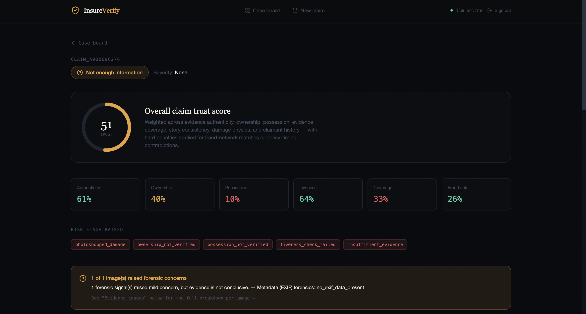
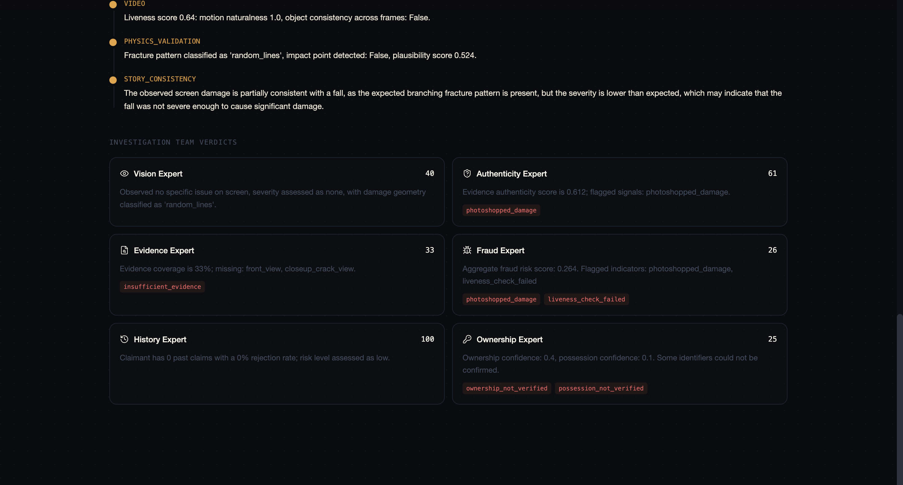

<div align="center">

# 🛡️ InsureVerify

**An AI insurance investigator, not a damage detector.**

[](https://www.python.org/)
[](https://fastapi.tiangolo.com/)
[](https://react.dev/)
[](https://tailwindcss.com/)
[](https://firebase.google.com/)
[](https://ollama.com/)
[](LICENSE)

</div>

---

## What is InsureVerify?

Most "AI damage detection" demos answer one question: **is there damage in this photo?**

InsureVerify answers the question an actual human claims investigator asks instead:

> **Can this evidence be trusted? Does the claimant really own and possess this
> object? And does the damage actually match the story they told?**

It does this by running every submitted claim through an **11+ stage
investigation pipeline** — evidence forensics, ownership verification,
possession verification, damage liveness, story-consistency cross-checking,
physics-based fracture validation, fraud-network detection across the
*entire* claim history — and a **6-agent review team plus a judge agent**
that combines everything into one auditable verdict, complete with a
literal chain of evidence explaining every score.

It's built to be a genuine, working system end to end: a FastAPI backend, a
real React frontend with Firebase authentication, real computer-vision
forensics (EXIF analysis, Error Level Analysis, perceptual hashing, optical
flow), real OCR, and optional local LLM/VLM reasoning via Ollama — all
runnable for free, with no paid API keys required.

## Table of contents

- [Screenshots](#screenshots)
- [What makes this different](#what-makes-this-different-from-a-typical-damage-detector)
- [Key features](#key-features)
- [Architecture](#architecture)
- [Requirements](#requirements)
- [Setup & Run](#setup--run)
- [Troubleshooting](#if-verification-feels-slow)
- [Running without Ollama](#running-without-ollama)
- [CSV export](#csv-export-outputcsv)
- [Explainable fraud detection](#explainable-fraud-detection)
- [Notes on the heuristic detectors](#notes-on-the-heuristic-detectors)
- [Extending the platform](#extending-the-platform)

---

## Screenshots

## Screenshots

### Landing Page


### Login Page


### Dashboard


### Claim Detail


## What makes this different from a typical "damage detector"

| Typical CV demo | InsureVerify |
|---|---|
| "There's a crack in this image" | "There's a crack — but the photo's EXIF says it was taken before the policy started, the serial number doesn't match what you told us, and the same photo was used in claim #4821" |
| Single model, single score | 11 independent stages + 6 specialist agents + a judge, each contributing a named, auditable score |
| Trusts the claim text | The vision model never sees the claim text — it's deliberately kept blind, so Story Consistency is a genuine independent cross-check, not the model parroting back what it was told to find |
| Looks at one claim in isolation | Cross-references every new claim against the **entire claim history** for duplicate photos and shared device identifiers (fraud-ring detection) |

## Key features

- 🔍 **11+ stage verification pipeline** — evidence authenticity, ownership, possession, damage liveness, evidence sufficiency, vision-language analysis, claim understanding, story consistency, physics-based fracture validation, risk scoring, adaptive verification
- 🕸️ **Fraud Network Engine** — flags reused photos or shared serials/VINs/plates across *different, "unrelated" claims and accounts*, not just within one claim
- 🛰️ **Temporal & Geo Consistency** — catches damage photos timestamped before the policy started, or GPS-tagged outside the claimant's registered region
- 🧬 **Physics-based fracture validation** — real Hough-line geometry checks whether a crack actually converges on a plausible impact point and branches the way real fractures do
- 🎥 **Damage liveness via video** — distinguishes genuine handheld verification footage from a looped photo or screen-recording, using motion analysis and ORB feature tracking
- 🤖 **Three-layer AI-edit detection** — localized/regional statistics, bidirectional multi-quality Error Level Analysis, and a VLM semantic check, layered together specifically to catch partial AI-inpainted edits on otherwise-real photos
- 🗣️ **Explainable fraud reasoning** — every flagged image comes with a plain-language breakdown of exactly what was measured and why it matters, not just a score
- 👥 **6 specialist agents + a judge agent** — Vision, Authenticity, Evidence, Fraud, History, and Ownership experts each weigh in before a final, auditable verdict is rendered
- 🔐 **Firebase Authentication** — email/password and Google sign-in gating the platform behind a landing page
- 📊 **CSV export** — automatic per-claim and on-demand batch export to a fixed `output.csv` schema
- 🖥️ **Polished, animated frontend** — React + Tailwind + Framer Motion, with scroll-triggered landing-page animations and a live verification progress timer
- 🆓 **Runs entirely free** — classical CV/OCR fallbacks work with zero API keys; optional local Ollama (`llava` + `llama3`) for LLM/VLM reasoning, no paid services required

---

## Architecture

```
insureverify/
├── backend/                  FastAPI + Python pipeline
│   ├── main.py                API entrypoint
│   ├── app/
│   │   ├── core/               schemas, taxonomy, pipeline orchestrator
│   │   ├── stages/              Stage 0–10 + bonus stages (one file per stage)
│   │   ├── agents/              6 specialist agents + judge agent
│   │   ├── db/                  lightweight JSON claim store
│   │   └── utils/                OCR (EasyOCR) + Ollama client wrappers
│   └── data/
│       ├── claims_db/            saved claim records (JSON)
│       ├── uploads/               uploaded evidence images/videos
│       └── sample_images/        a couple of ready-to-use demo images
├── frontend/                 React + Tailwind + Framer Motion UI
│   └── src/
│       ├── pages/                Dashboard, New Claim, Claim Detail
│       └── lib/api.js            backend API client
├── setup.sh / setup.bat       one-time dependency installer
├── run_backend.sh/.bat        starts the API on :8000
└── run_frontend.sh/.bat       starts the UI on :5173
```

### The pipeline, stage by stage

| Stage | What it does | Key technique |
|---|---|---|
| 0 | Evidence Authenticity | EXIF forensics, Error Level Analysis, AI-generation heuristics (noise floor / FFT / channel correlation), reflection/lighting consistency, perceptual-hash cross-image check |
| 1 | Ownership Verification | EasyOCR text extraction + regex parsing for serials/VINs/plates, cross-checked against claimant's declared details |
| 2 | Possession Verification | Unique per-claim challenge code, OCR-detected in evidence |
| 3 | Damage Liveness | Video frame sampling, motion-naturalness scoring, ORB feature matching across frames |
| 4 | Evidence Sufficiency | Required-view taxonomy lookup + heuristic view classification (edge density / concentration) |
| 5 | Vision-Language Analysis | Local `llava` via Ollama (claim-text-blind), with a classical-CV fallback if Ollama isn't running |
| 6 | Claim Understanding | Local `llama3` via Ollama, with a keyword/regex fallback |
| 7 | Story Consistency | Cross-checks Stage 5 (observed) vs Stage 6 (claimed) — the core fraud-catching cross-reference |
| 8 | Physics-Based Validation | Hough-line fracture geometry, impact-point convergence, branching-complexity scoring |
| 9 | User Risk Engine | Claim history → risk score → risk level |
| 10 | Adaptive Verification | Decides what extra evidence to demand based on risk level |
| Bonus | Temporal/Geo + Fraud Network | Policy-timing and cross-claim duplicate/shared-identifier detection |
| 11 | Multi-Agent + Judge | 6 specialist agents (Vision/Authenticity/Evidence/Fraud/History/Ownership Experts) + a Judge Agent that renders the final, auditable verdict |

Every stage is a **real, working implementation** — not a stub. Where a
heavy pretrained model (llava/llama3) isn't available, the corresponding
stage automatically degrades to a classical computer-vision or rule-based
fallback rather than crashing, so the platform always produces a result.

---

## Requirements

- **Python 3.10+**
- **Node.js 18+** and npm
- **Ollama** (optional but recommended) — for the full LLM/VLM reasoning layer, free and runs locally. Without it, the platform still works using classical CV/OCR/regex fallbacks for every stage, just with less nuanced natural-language reasoning.

---

## Setup & Run

### 1. One-time setup

**Linux / macOS:**
```bash
chmod +x setup.sh run_backend.sh run_frontend.sh
./setup.sh
```

**Windows:**
```
setup.bat
```

This creates a Python virtual environment, installs all backend
dependencies (FastAPI, OpenCV, EasyOCR, PyTorch/timm, etc.), installs all
frontend dependencies (React, Tailwind, Framer Motion), and — if Ollama is
installed — pulls the `llava` and `llama3` models.

If you don't have Ollama yet and want the full LLM-powered experience:
1. Install it from **https://ollama.com**
2. Run: `ollama pull llava` and `ollama pull llama3`
3. Make sure `ollama serve` is running (it usually runs automatically after install) before starting the backend.

### 2. Set up Firebase Authentication

The app shows a landing page and login screen before the actual claim
platform. Without Firebase configured, the app still runs (you'll see a
clear "Firebase isn't configured" notice on the login screen and can click
through anyway in dev), but to enable real email/password and Google
sign-in:

1. Go to **https://console.firebase.google.com** and open your project (or create a new one dedicated to InsureVerify).
2. **Project settings → General → Your apps → Add app → Web** (the `</>` icon). Register the app (no Firebase Hosting needed).
3. Copy the `firebaseConfig` object it gives you.
4. **Authentication → Sign-in method** → enable **Email/Password** and **Google**.
5. In `frontend/`, copy `.env.example` to `.env`:
   ```bash
   cd frontend
   cp .env.example .env
   ```
6. Fill in the six `VITE_FIREBASE_*` values in `.env` from the config you copied in step 3.
7. Restart the frontend dev server if it was already running (Vite only reads `.env` on startup).

That's it — no backend changes needed. Auth is entirely client-side; the
backend API itself doesn't currently check tokens (see "Extending the
platform" below if you want to lock down the API too).

### 3. Run the platform

Open **two terminals**:

**Terminal 1 — backend:**
```bash
./run_backend.sh        # Linux/macOS
run_backend.bat         # Windows
```
This starts the API at `http://localhost:8000`. The first time EasyOCR
runs, it will download its text-detection model weights (a few hundred MB,
one-time).

**Terminal 2 — frontend:**
```bash
./run_frontend.sh       # Linux/macOS
run_frontend.bat        # Windows
```
This starts the UI at `http://localhost:5173`.

Open **http://localhost:5173** in your browser.

### 4. Try it out

1. You'll land on the **landing page** first — scroll through it, then click "Get started".
2. If Firebase is configured, you'll hit a **sign-in screen** — create an account with email/password, or continue with Google.
3. Click **"New claim"**.

### Taking screenshots for the README

If you want the screenshots in this README to render (see the gallery near
the top), capture these 6 and save them into `screenshots/` with these
exact filenames:

| Filename | What to capture |
|---|---|
| `screenshots/landing.png` | The hero section of the landing page (first thing you see) |
| `screenshots/login.png` | The sign-in screen |
| `screenshots/dashboard.png` | The case board with a few claims filed |
| `screenshots/new-claim.png` | The "File a claim" form, or the live verification progress screen |
| `screenshots/claim-detail.png` | A completed claim's verdict page (trust score + chain of evidence) |
| `screenshots/forensic-detail.png` | The per-image forensic drill-down modal, ideally on an image that raised a flag |

PNG or JPG both work. After adding them:
```bash
git add screenshots/
git commit -m "Add screenshots"
git push
```
2. Pick an object type (laptop/car/package), describe what happened.
3. You'll get a unique challenge code (e.g. `CLAIM-58291`) — in a real
   scenario you'd write this on paper next to the object before
   photographing it. For a quick demo, you can skip this and just upload
   evidence photos.
4. Upload the sample images in `backend/data/sample_images/` (or your own
   photos), optionally a short video, and submit.
5. Watch the investigation run, then explore the full verdict: trust score,
   per-category scores, risk flags, the chain of evidence, and all six
   agent verdicts.

---

## If verification feels slow

A claim should take well under a minute. If it's taking many minutes:

1. **Check what's actually running**: `curl http://localhost:8000/api/health` (or visit it in a browser). If `ollama_available` is `true`, every claim is making real `llava`/`llama3` calls — on CPU-only hardware these can take real time, especially `llava` per image.
2. **Force fast mode** if you want guaranteed near-instant results using only classical CV/OCR/regex (no LLM calls at all):
   ```bash
   # Linux/macOS
   export INSUREVERIFY_FAST_MODE=1
   ./run_backend.sh

   # Windows (cmd)
   set INSUREVERIFY_FAST_MODE=1
   run_backend.bat
   ```
   Unset it (or set to `0`) to go back to full LLM reasoning.
3. **The UI now shows a live elapsed timer and stage checklist** during verification (in the "New claim" flow), so you can see real progress instead of an indefinite spinner, and it'll warn you if a run is taking unusually long.
4. Per-image vision analysis now runs **in parallel** (up to 4 images at once) rather than one-by-one, and per-agent LLM narration calls were removed (they added 6 extra sequential round-trips for purely cosmetic rephrasing of already-computed facts) — only 3 LLM calls remain per claim (claim understanding, story consistency, final justification), plus one `llava` call per image.

## Running without Ollama

Every stage has a deterministic fallback, so the platform is fully
functional without Ollama installed:
- Vision analysis falls back to classical edge/contour-based damage heuristics.
- Claim understanding falls back to keyword/regex extraction against the taxonomy.
- Story consistency still runs its rule-based contradiction checks (e.g. claimed mechanical fall vs. observed water damage) — this is deterministic and doesn't need an LLM at all.
- Agent summaries fall back to template-generated sentences from the same underlying scores.

You'll see a small status indicator in the top-right of the UI ("llm
online" / "cv-only mode") showing which mode is active.

---

## CSV export (output.csv)

Every verified claim is automatically appended as one row to
`backend/data/output.csv`, using a fixed 14-column schema: `user_id,
image_paths, user_claim, claim_object, evidence_standard_met,
evidence_standard_met_reason, risk_flags, issue_type, object_part,
claim_status, claim_status_justification, supporting_image_ids,
valid_image, severity`.

- **Automatic, per-claim**: happens right after every `POST
  /api/claims/{id}/verify` call — no extra step needed.
- **Batch, on-demand**: click "Export output.csv" on the dashboard (or call
  `POST /api/export/csv`) to regenerate the file from every claim currently
  in the store, then download it via `GET /api/export/csv`.

All values are read directly from already-computed pipeline outputs — see
`backend/app/core/csv_export.py` for the exact mapping (most fields are a
direct passthrough; `evidence_standard_met`, `supporting_image_ids`, and
`valid_image` are derived from existing coverage/authenticity scores using
the same thresholds the pipeline already uses elsewhere, not new judgement
logic).

## Explainable fraud detection

Every per-image authenticity score is backed by a structured explanation,
not just a number — see `backend/app/agents/fraud_explanation.py`. For each
image, it surfaces: which specific forensic check fired (metadata, ELA,
AI-generation stats, lighting consistency), the actual measured value, and
a plain-language reason why that measurement indicates possible tampering
— including the VLM's own stated reasoning when that layer flags something.
This shows up two ways in the UI: a one-line inline summary on the claim
detail page (visible without clicking anything), and a full evidence
breakdown when you click into any evidence image's forensic drill-down.

---

## Notes on the heuristic detectors

The AI-generated-image detector, ELA, and physics-based fracture validator
are **real, working classical techniques** (documented in each file's
docstring), not trained neural classifiers — they're intentionally
transparent and explainable, which matters for an auditable insurance
decision.

**A known, important limitation**: whole-image statistical checks (overall
noise floor, FFT spectrum, channel correlation) are reasonably effective at
catching *fully synthetic* images, but are weak against a real photo that's
been **partially edited/inpainted** by a modern AI image tool (e.g. taking
a real phone photo and asking an image model to add a crack to it) —
because the untouched majority of the photo's real sensor statistics
dominates the whole-image average and dilutes the local edit's signature.
This is a real-world tested gap, not a theoretical one, and modern AI image
editors are specifically optimized to blend edits seamlessly at the
pixel-statistics level.

To address this, Stage 0's authenticity scoring layers three independent
signals rather than relying on any one:
1. **Localized/regional statistics** (`stage0_visual_forensics.py` —
   `_detect_localized_anomaly`): tiles the image into a grid and flags
   cells whose noise characteristics deviate sharply from the *rest of the
   same image*, catching edits that are invisible in a whole-image average.
2. **Multi-quality, bidirectional ELA** (`stage0_ela.py`): runs Error Level
   Analysis at two JPEG quality levels and flags regions that are
   abnormally *low* error (consistent with smooth AI inpainting) as well as
   abnormally *high* error (consistent with classic copy-paste splicing).
3. **VLM semantic edit check** (`stage0_vlm_edit_check.py`): a targeted
   `llava` prompt asking specifically about inconsistent lighting/shadows,
   unnaturally smooth edges, or texture mismatches — a genuinely different
   kind of signal (visual/semantic judgment) than pixel statistics, and the
   one most likely to catch subtle, well-blended edits that fool both
   classical checks above. Requires Ollama; degrades gracefully (skipped,
   not blocking) if it isn't running.

Even layered, these remain heuristics with real false-negative risk on a
sufficiently well-blended edit — for production deployment at meaningful
fraud-detection stakes, supplement with a dedicated trained AI-image/deepfake
detector (commercial API or open model) as a fourth layer; the architecture
is built so you can drop one in alongside the existing three without
touching the rest of the pipeline.
---

## Extending the platform

- **Swap the JSON claims store for a real DB**: only `backend/app/db/claims_store.py` needs to change — every stage depends on the Pydantic schemas in `core/schemas.py`, not on storage directly.
- **Add a real fine-tuned damage classifier**: drop a `timm`-based EfficientNet model (same pattern as the AgriAI project) into `app/stages/stage5_vision.py`'s fallback path for higher-precision severity scoring without Ollama.
- **Add more object types**: extend `app/core/taxonomy.py` with new parts/issues/evidence requirements — every stage reads from this file, so no other code changes are needed.
- **Real geofencing**: replace the coarse bounding-box lookup in `app/stages/stageX_temporal_geo.py` with a real reverse-geocoding API.
- **Lock down the backend API with the same Firebase auth**: currently auth only gates the frontend UI — the FastAPI backend accepts any request. To actually enforce it server-side, verify the Firebase ID token (sent via an `Authorization: Bearer <token>` header from the frontend) using the `firebase-admin` Python SDK in a FastAPI dependency, and require it on the claim-mutating endpoints.

## Contributing

This started as a learning/demo project, but issues and pull requests are
welcome — especially around:
- Swapping the heuristic AI-edit detectors for a trained model
- Adding a real database backend (see "Extending the platform" above)
- Hardening the API with real Firebase token verification
- New object types / claim categories in `app/core/taxonomy.py`

If you're picking this up, the codebase is organized so each pipeline stage
is one file under `backend/app/stages/`, independently testable — that's
the easiest place to start.

## License

MIT — see [LICENSE](LICENSE). Use it, fork it, build on it.

## Acknowledgments

- [Ollama](https://ollama.com/) for making local LLM/VLM inference trivial to set up
- [EasyOCR](https://github.com/JaidedAI/EasyOCR) for OCR
- [OpenCV](https://opencv.org/) for the classical computer-vision forensics
- [Firebase](https://firebase.google.com/) for authentication